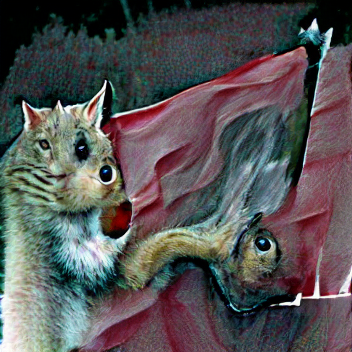
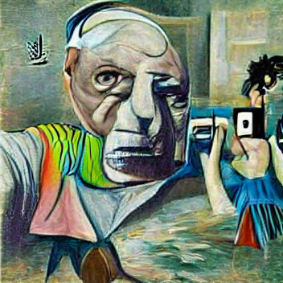
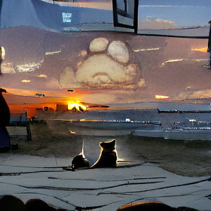

## AI Generated Art

This is an AI art generator using VQGAN+CLIP. More info and updates coming up soon.

#### Some sample images:

|Result                                          | Description                                                 |
|------------------------------------------------| ------------------------------------------------------------|
|</img>| Dreamy picture of a cat squirrel hybrid holding a red flag  |
|</img>| A colorful painting of Picasso taking selfie                |
|</img>| A dog and a cat watching sunset on the beach                |

Use `accent` flag to put emphasize on certain color ranges

### Installation:
- pip install:
  `numpy pandas matplotlib torch torchvision kornia`
- clone these repositories to root dir
  - `git clone https://github.com/openai/CLIP`
  - `git clone https://github.com/CompVis/taming-transformers`
- you will need the vqgan pretrained model (put them in a folder called "checkpoints")
    - vqgan_imagenet_f16_16384.ckpt
    - vqgan_imagenet_f16_16384.yaml
- Hopefully, you have GPU available; otherwise, it will be pretty slow
- [optional] clone upscaler to scale up the final result
    - `git clone https://github.com/jacky776690g60/upscaler.git`
